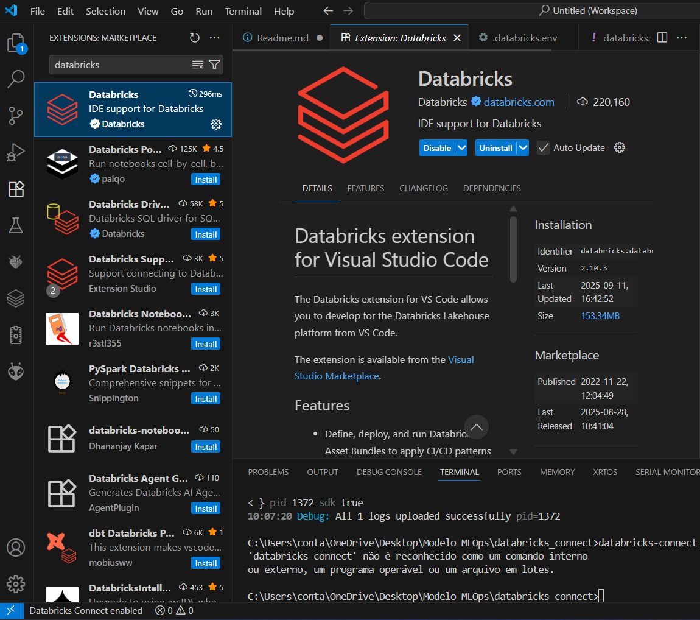
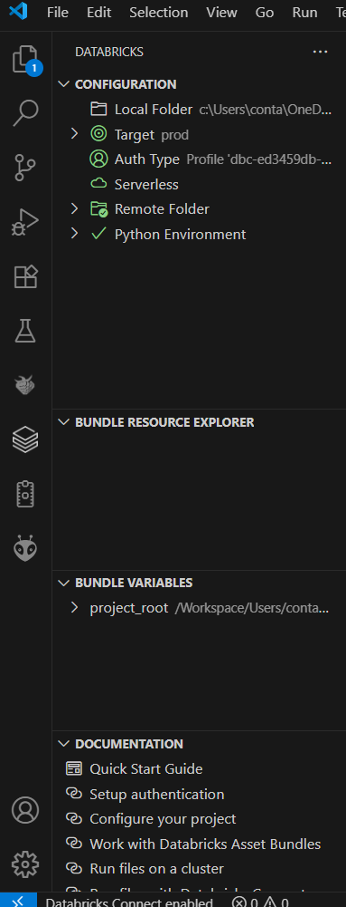

# 🚀 Conectando VSCode ao Databricks com Databricks Connect

Este repositório contém um tutorial prático para configurar e utilizar o Databricks Connect para integrar o **VSCode** ao **Databricks**, permitindo desenvolvimento, sincronização e implantação de código diretamente no workspace.

---

## 📌 Objetivo

O objetivo deste projeto é servir como guia para:

⚙️ Configuração do Databricks Connect no VSCode.\
🏗️ Criação de ambientes de desenvolvimento (dev) e produção (prod).\
🔄 Sincronização de arquivos locais com o workspace no Databricks.\
🚀 Deploy de bundles para diferentes ambientes.

---

## 🛠️ Pré-requisitos

Antes de iniciar, você precisa ter:

✅ Conta no Databricks com permissões para criar e sincronizar bundles.\
✅ VSCode instalado.\
✅ Plugin Databricks VSCode instalado.\
✅ Python 3.9+ instalado.\
✅ Databricks CLI instalado.\
✅ Databricks Connect configurado.

---

## 📦 Instalação do Databricks Connect 

Instale o pacote `databricks-connect`, no painel do lado esquerdo em extensões digite databricks para procurar o plugin, após encontrar é só instalar:



Logo em seguida é necessário configurar o plugin basta selecionar novamente no paineldo lado esquerdo em no icone `Databricks` e configurar os itens.



## 📂 Estrutura do Repositório

├── .databricks/\
├── .venv\
├── .vscode\
├── dev/ # ambiente de desenvolvimento\
├── docs\
├── prod/ # ambiente de produção \
├── typings/\
├── .gitignore\
├── databricks.yml # arquivo responsável pelas configurações do Databricks\ 
└── Readme.md

Os diretórios `dev/` e `prod/` são gerados pelo deploy do Databricks Bundle e representam os ambientes de desenvolvimento e produção.

---

## 📜 Comandos Importantes
### ✅ Validação do Código
```
databricks bundle validate

# ou caso não encontre o profile

databricks bundle validate --profile <e-mail_databricks_ou_token_url> --debug
```

### 📦 Deploy para os Ambientes
```
# Deploy para DEV
databricks bundle deploy --target dev 

# ou caso não encontre o profile 

databricks bundle deploy --target dev --profile <e-mail_databricks_ou_token_url> --debug

# Deploy para PROD
databricks bundle deploy --target prod

# ou caso não encontre o profile

databricks bundle deploy --target prod --profile <e-mail_databricks_ou_token_url> --debug
```

### 🔄 Sincronização de Arquivos
```
databricks bundle sync

# ou caso não encontre o profile

databricks bundle sync --target dev --profile <e-mail_databricks_ou_token_url> --debug
```

💡 Dica:
Na primeira vez que for sincronizar, utilize o databricks_connect.
Sempre que for sincronizar, altere o target do databricks_connect para o ambiente correto (dev ou prod).\
A tag `--debug` é para mostrar os passos do deploy.

---

## 🧹 Arquivos Ignorados no Git

O arquivo `.gitignore` está configurado para ignorar:
```
.databricks
typings
.gitignore
databricks.yml
Readme.md
dev/
prod/
```

---

## 🛠️ Troubleshooting (Erros Comuns)

Aqui estão alguns problemas comuns e como resolvê-los:
### ❌ `Metadata Service returned empty token`
Esse erro indica que o Databricks CLI não conseguiu autenticar automaticamente.
### ✅ Solução: Reconfigure o token manualmente:
```
databricks configure --token
```

--- 

### ❌ `multiple profiles matched: ... please set DATABRICKS_CONFIG_PROFILE`
O CLI encontrou múltiplos perfis no seu arquivo `~/.databrickscfg`.
### ✅ Solução: Defina o perfil explicitamente antes de rodar os comandos:
```
set DATABRICKS_CONFIG_PROFILE=nome_do_perfil  # Windows PowerShell
export DATABRICKS_CONFIG_PROFILE=nome_do_perfil  # Linux/MacOS
```

---

### ❌ `ModuleNotFoundError: No module named 'app'`
Se ocorrer ao rodar testes no VSCode, certifique-se de que o PYTHONPATH está configurado corretamente.
### ✅ Solução: No launch.json, adicione:
```
"env": {
  "PYTHONPATH": "${workspaceFolder}"
}
```

---

### ❌ `Problemas de Sincronização`

* Verifique se o `databricks bundle sync` está usando o target correto (dev ou prod).
* Sempre rode `databricks bundle validate` antes de sincronizar para detectar problemas de configuração.

## 👨‍💻 Sobre

Autor: Thiago Vilarinho Lemes <br>
Home: https://thiagolemes.netlify.app/ \
LinkedIn <a href="https://www.linkedin.com/in/thiago-v-lemes-b1232727" target="_blank">Thiago Lemes</a><br>
e-mail: contatothiagolemes@gmail.com | lemes_vilarinho@yahoo.com.br